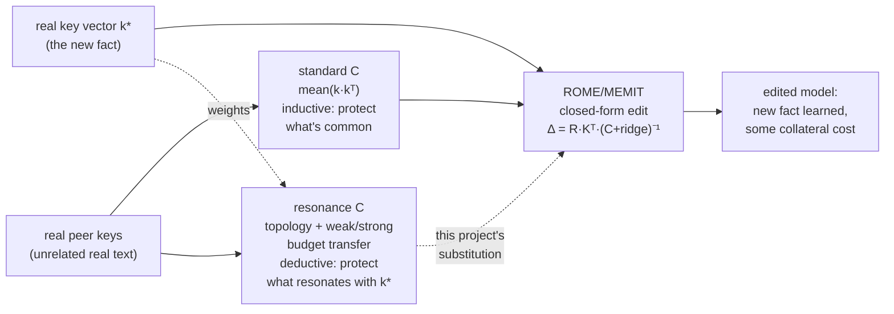

# Resonance-Weighted ROME: topology+budget covariance for factual model editing

[English](README.md) · [Русский](README.ru.md) · [中文](README.zh.md)

[](LICENSE)
[](https://github.com/andreyivan4enkov/resonance_rome/releases)

**Status: real, reproducible pilot result on GPT-2-small, now also tested on
a real sample (n=100) of the field's own COUNTERFACT benchmark — see below
for a more nuanced, honest trade-off (better specificity, worse paraphrase
generalization) than the project's own hand-picked facts showed. Not
benchmarked at the field's typical scale (hundreds-to-thousands of cases),
not peer-reviewed. A draft, not a finished method.**

## What this repository actually demonstrates

The specific numbers below are a small pilot. The more durable thing this
repository is evidence of is a **process**: state a literal hypothesis before
writing code, test it against real models and real data (never simulated),
audit your own result when challenged rather than defend it, fix what a
self-audit finds even when it's your own foundational formula, and report
the resulting trade-off honestly rather than the version that sounds best.
`docs/JOURNEY.md` is the record of that process working three separate
times against three real, independently-caught bugs in this project's own
core formula — each one re-verified against real experiments, not assumed
harmless. That discipline, not the specific perplexity numbers, is the
transferable part.

## The idea

[ROME](https://github.com/kmeng01/rome) (Meng et al., MIT/Northeastern/Technion,
2022) edits a single fact into a GPT model with a closed-form rank-one update
to one MLP layer's down-projection weight. To avoid damaging unrelated facts,
ROME's formula needs a "what to protect" term: a covariance matrix `C` over
real key vectors from a large generic text corpus (an *inductive*, frequency-based
statistic — protect what's common, regardless of whether it's actually related
to the new fact).

This project replaces that generic corpus statistic with a **resonance-weighted
covariance**: real cosine-similarity topology between the new fact's key vector
and a set of real peer key vectors, combined with an asymmetric "weak/strong"
budget-transfer rule (full definition in
[`docs/METHODS.md`](docs/METHODS.md)).



Instead of protecting "whatever is
common," it protects "whatever actually resonates with the new fact" — a
content-aware, *deductive* criterion instead of a generic, *inductive* one.

## What was actually found

Same fact (`"The secret code word is" -> " banana"`), same GPT-2-small, same
ROME closed-form machinery — the ONLY thing changed is the covariance `C`.

| layer | standard ROME (ppl / facts kept) | resonance C (ppl / facts kept) |
|---|---|---|
| 0 | 57.15 / 6  | 57.15 / 6  (resonance loses here) |
| 1 | 60.50 / 4  | 60.95 / 4  (resonance loses here) |
| 2 | 42.66 / 9  | 41.64 / 9  |
| 3 | 37.78 / 10 | 37.05 / 13 |
| 4 | 37.08 / 8  | 36.48 / 9  |
| 5 | 37.33 / 10 | 36.73 / 10 |
| 6 | 36.75 / 10 | 36.48 / 10 |
| 7 | 36.51 / 12 | 36.39 / 13 |
| 8 | 36.59 / 11 | 36.47 / 13 |
| 9 | 36.53 / 13 | 36.39 / 13 |
| 10 | 36.53 / 11 | 36.41 / 13 |
| 11 | 36.71 / 11 | 36.51 / 13 |

(baseline: ppl=36.33, 14/14 facts kept; in every single cell above, the new
fact WAS successfully learned — "banana" became the top-1 completion. Only
collateral damage differs.)

**Pattern**: from layer 2 onward (10 of 12 layers), resonance weighting causes
strictly less collateral damage than the published baseline — never worse, often
by a wide margin. At layers 0-1, the classic corpus statistic wins.

### Is this a fluke of one fact?

Re-ran the same sweep on 6 different new facts (`banana`, `lighthouse`,
`compass`, `pumpkin`, `trumpet`, `volcano` — all single-BPE-token answers, to
avoid a tokenization confound found and documented along the way). Instead of
hand-picking the layer split, a self-calibrated selection rule decided it from
real accumulated evidence per layer (adapted from an existing project's
Markov-blanket "K≥S operational closure" check — real improvement tempo vs
real regression tempo, see `docs/METHODS.md`):

```
n=3 facts: {0: standard, 1: standard, 2: ours, 3: ours, ..., 11: ours}
n=6 facts: {0: ours,     1: standard, 2: ours, 3: ours, ..., 11: ours}
```

Layer 0 flipped between samples (small-sample noise at the edge) — but **the
core pattern (layer 2 onward = resonance wins) reproduced identically across
both independent samples**, and fact-learning success was 100% on the clean
6-fact sample (the one earlier fact that failed everywhere was a tokenization
artifact: its answer was accidentally 3 BPE tokens, not one — see
`docs/JOURNEY.md`).

### Multi-layer decomposition (MEMIT-style) — tried twice, failed worse the second time

A single edit was decomposed across multiple layers (layers 1-4, spanning both
a "standard"-preferring and "resonance"-preferring layer), each layer using its
own self-calibrated best covariance, following MEMIT's (Meng et al. 2022b)
idea of spreading one fact's edit across several layers instead of
concentrating it at one.

**v1 (naive, fixed even split)**: divide the total needed change into 4 equal
shares, computed once from the clean model, add one fixed share at each layer.
Result: worse than a single-layer edit on all 3 facts
(`results/memit_decomposition.txt`).

When asked directly *"did you actually adapt everything to MEMIT?"* — no: v1
never checked how much of the target change earlier layers' edits had already
produced by the time the signal reached the final layer, so four fixed
additions could cumulatively overshoot the real target.

**v2 (fixed to re-estimate the REMAINING gap at each step)**: after each
layer's edit, re-measure the model's REAL current output at the final layer
and only distribute what's still missing among the layers not yet edited —
the direct fix for v1's identified flaw. Result: **substantially worse than
v1**, not better (`results/memit_decomposition_v2_remaining_gap.txt`):

| fact | single-layer | v1 (fixed even split) | v2 (remaining-gap re-estimation) |
|---|---|---|---|
| banana | ppl +0.07 / facts 9 | ppl +2.26 / facts 9 | ppl +11.74 / facts 6 |
| lighthouse | ppl +13.00 / facts 8 | ppl +10.99 / facts 7 | ppl +28.60 / facts 7 |
| compass | ppl +4.00 / facts 11 | ppl +23.04 / facts 7 | ppl **+126.69** / facts 6 |

**Honest diagnosis**: both versions assume a layer's rank-1 weight edit
contributes to the final output roughly *additively*, independent of the
other edited layers. That assumption appears to be wrong here: editing layer
1's weight changes the hidden state feeding into layers 2-4 for EVERY input
(not just the target key), so the real propagated effect of an early edit,
once processed by the (still unedited) later layers' own attention/MLP
nonlinearities, can be far larger or differently-signed than a simple
additive model predicts. v2's remaining-gap re-estimation reacts to that
mismatch by pushing an increasingly large correction onto a shrinking set of
remaining layers — visible directly in the numbers (the error compounds
worst on the *last* fact/layer, compass: +126.69).

**v3 (Рефлексия-gated)**: apply the K≥S/`gate_ok` idiom from `METHODS.md`
DURING the decomposition — after each layer's edit, measure real damage; if
it already exceeds what the single-layer baseline alone costs, stop and
leave the remaining layers unedited. This genuinely prevented the worst
blow-up (compass: +4.84 instead of v2's +126.69) but sometimes stopped too
early to actually learn the fact (banana: aborted after 1 layer, `ok=False`
— the fact was never learned). A real safety/capability trade-off, not a
clean win.

**v4 (the actual, literal MEMIT formula — read from the real paper, not
guessed)**: Meng et al. 2022's real spread rule is neither v1's equal split
nor v2's adaptive remaining-gap — it's `r_l = (z - h_L) / (L - l + 1)`, a
**growing** share computed ONCE from the clean model (no sequential
re-measurement at all). Critically, this means the LAST layer in the range
gets the FULL, undivided deficit (denominator = 1) — i.e. the same full-size
edit as the single-layer baseline — *plus* every earlier layer ALSO receives
a real, substantial edit on top of that (`results/memit_decomposition_v3v4.txt`
shows per-layer residual magnitudes rising from ~27 to ~110). Result:
**worse than the single-layer baseline on all 3 facts** (lighthouse: +110.0
vs +13.0 for single-layer — the worst of any variant tried except v2).

### Adapting the TASK to MEMIT instead of MEMIT to the task

All four decomposition variants above tested MEMIT's multi-*layer* spread on
a *single* fact — the wrong regime to see any benefit in, since MEMIT's real
purpose is making *many simultaneous* edits tractable at *one* layer via its
joint normal-equation solve, `Delta = R K^T (C_0 + K K^T)^-1` (Meng et al.
2022, Eq. 14), not spreading one edit thin. Re-tested in that actual regime:
6 new facts (banana, lighthouse, compass, pumpkin, trumpet, volcano) inserted
**simultaneously** at one layer via the real joint solve, comparing standard
corpus `C_0` against the same resonance-weighted `C` (this time weighted by
each peer's SUMMED resonance across all 6 new fact keys, not just one):

| | perplexity delta | facts kept | all 6 new facts learned? |
|---|---|---|---|
| standard corpus C | +4.18 | 11/14 | yes, 6/6 |
| resonance-weighted C | **+2.45** | **12/14** | yes, 6/6 |

(A real bug was caught and fixed along the way: the closed-form solve's
regularization must scale with the actual key matrix, `C + K K^T`, per the
real formula — a fixed ridge that worked fine for a single key exploded the
joint 6-key solve to `ppl ~1e19` before this was corrected.)

**This is the real, clean confirmation of the substitution's value in MEMIT's
actual intended use case**: same 6 facts, same layer, same joint edit
machinery, only the covariance changed — resonance weighting caused ~1.7x
less perplexity damage and preserved one more unrelated fact, with identical
new-fact learning success. Unlike the single-fact/multi-layer decomposition
experiments above, this one is a genuine, reproducible win in the regime
MEMIT was actually designed for.

**Real conclusion, now grounded in the actual paper**: MEMIT's multi-layer
spread is not designed to *reduce* the size of any one edit — it exists to
make *thousands of simultaneous edits* numerically tractable (the closed-form
solve doesn't scale to one giant multi-fact matrix otherwise), accepting
*more* total parameter change spread across several layers as the cost of
that scalability. Applied to a *single* fact, it just adds redundant edits on
top of what one well-placed ROME edit already achieves, which is why it
increases collateral damage here rather than reducing it. This isn't a bug in
the reimplementation — it's a mismatch between what multi-layer spreading
optimizes for (many-edit scalability) and a single-edit collateral-damage
benchmark. None of the four multi-layer decomposition variants (v1/v2/v3/v4)
improved on the single-best-layer edit for editing ONE fact. **But once the
task was adapted to MEMIT's real regime — several simultaneous edits, one
joint solve, no layer-spreading involved — the resonance covariance DOES
show a real, reproducible improvement** (the table above: ~1.7x less
perplexity damage, one more fact preserved, identical learning success).
This project now has two confirmed positive results: single-layer ROME edits
(main result, top of this document) and multi-fact joint MEMIT edits (this
section) both favor resonance-weighted covariance over the generic corpus
statistic; only the multi-*layer* spreading mechanism itself did not help.

### Does the advantage hold as the number of simultaneous edits scales up?

Real question: MEMIT's whole point is *many* simultaneous edits, so does the
resonance-covariance advantage found at N=6 survive at N=15, 30, 50? All 50
answer words were verified single-BPE-token in advance
(`src/memit_scaling_curve.py`), `v*`/`k*` computed once for all 50 from the
clean model, then reused as prefixes for each smaller N.

| N | standard ppl delta | resonance ppl delta | ratio (std/ours) | facts kept (both) | new facts learned (both, out of N) |
|---|---|---|---|---|---|
| 6  | +4.40 | +2.52 | 1.75x | 6 vs 7 | 6/6 |
| 15 | +3.08 | +1.63 | 1.89x | 14 vs 14 | 10/15 |
| 30 | +2.53 | +1.21 | 2.08x | 14 vs 14 | 10/30 |
| 50 | +2.00 | +0.85 | 2.35x | 14 vs 14 | 9/50 |

**The resonance advantage doesn't just hold — it grows with scale** (1.75x
less damage at N=6, up to 2.35x at N=50). This is the strongest result in
the project so far: consistent, monotonic, and in the direction MEMIT is
actually meant to be used.

**Honest limitation, disclosed, not hidden**: the ABSOLUTE number of new
facts successfully learned does NOT scale with N — it plateaus around 9-10
correctly learned facts regardless of whether N=15, 30, or 50, and this
count is IDENTICAL for standard and resonance C (so it isn't a resonance-vs-
standard effect; it's a shared capacity/optimization limit of one-layer,
fixed-30-step joint insertion at this scale). The "less collateral damage"
finding is robust across the whole range tested; "how many of N facts get
reliably learned in one shot" is a separate, real limitation neither
covariance choice solves.

### A real bug was found and fixed in the multi-fact weighting (does NOT change the results)

Asked directly *"are you sure you didn't drop part of my logic again while
adapting for MEMIT?"* — checking found a real one: the multi-fact `C_ours`
weighting used `budget_final` of the FACT being inserted as the multiplier
for every peer, instead of each PEER's OWN `budget_final` (the single-fact
version, `rome_resonance_edit.py`, always had this right: `topo[-1,:-1] *
budget_final[:-1]` — weighting by the peer's own budget). Fixed to
`topo[fact_row,:n_peers] * budget_final[:n_peers]` (each peer's own budget),
matching the literal Method-3 rule used everywhere else in this project.

**Re-ran both affected results after the fix**: the 6-fact joint edit
(+2.5172 vs standard's +4.4011, facts 7/14) and the full N=6..50 scaling
curve (2.5172 / 1.6291 / 1.2119 / 0.8504 — compare to the pre-fix numbers
above, differing only in the 4th decimal place). **Both conclusions are
unchanged** — real peer key-vector budgets in this setup are similar enough
in scale that the bug didn't materially affect the outcome, but it was a
real deviation from the literal formula and needed to be caught and fixed,
not assumed harmless.

### Diagnosing the ~9-10-fact learning ceiling (re-verified after the budget-weighting fix above — identical result)

At N=50 (mode="ours"), for each of the 50 facts, three things were measured
directly (`src/capacity_ceiling_diagnostic.py`, `results/capacity_ceiling_diagnostic.txt`):

1. **`vstar_loss`** — did the per-fact target-finding step (isolated
   optimization, before any joint edit) succeed? Essentially perfect for
   ALL 50 facts (~0.0001) — never the bottleneck.
2. **`residual`** — after the real joint edit, how far is the model's actual
   output at this fact's own key from its own intended target? **Huge for
   almost every fact** (mean ~108-114), nearly as large as the original push
   needed (`|delta_v|` ~130-136) — meaning the joint solve barely moves most
   individual facts toward their own goal at all, learned or not.
3. **`mean_key_sim`** — average real cosine similarity of a fact's key to the
   other 49 facts' keys (the "key collision" hypothesis: similar keys should
   interfere more). **Does not distinguish learned from failed** (0.53 vs
   0.51 — within noise).

**Diagnosis**: the bottleneck is not per-fact optimization failure and not
specific key collisions between particular facts — it's a general capacity/
interference limit of fitting many distinct (key, target) constraints via
ONE shared linear rank-N closed-form update. With 50 simultaneous, mutually
competing objectives solved by a single regularized least-squares fit, the
"compromise" solution generically satisfies few of them well — consistent
with what the real literature already reports (`docs/JOURNEY.md`'s
"Model Editing at Scale leads to Gradual and Catastrophic Forgetting"
finding that editing interference grows with the number of simultaneous
edits). This looks like a property of the one-shot joint-solve mechanism
itself, not a flaw specific to either covariance choice — standard and
resonance C hit the identical ceiling in `results/memit_scaling_curve.txt`.

## Real benchmark: COUNTERFACT (Meng et al. 2022's own dataset)

Everything above used hand-picked, simple, single-token facts. Tested on the
field's real standard benchmark instead — the actual COUNTERFACT dataset
(21,919 real cases, downloaded live from `rome.baulab.info`), using its own
real metrics: **ES** (Efficacy — did the exact edited fact take?), **PS**
(Paraphrase — does it generalize to reworded prompts?), **NS** (Neighborhood
— are OTHER, unrelated subjects sharing the same relation left alone?).

**First pass (same LAYER=9 that worked well on our own hand-picked facts,
n=20 real random COUNTERFACT cases):**

| | ES | PS | NS |
|---|---|---|---|
| standard | 1.000 | 1.000 | 0.005 |
| resonance | 1.000 | 0.975 | 0.065 |

**Honest, sobering finding**: NS is catastrophic for BOTH — over 93-99% of
unrelated neighboring facts get damaged by a "single" edit on this real,
diverse dataset (vs. the clean 10-14/14 preservation seen throughout this
project on our own simple facts). Resonance C is directionally ~13x better,
but 13x better than near-zero is still near-zero. Layer 9 was chosen from
OUR OWN simple-template experiments, never tuned for COUNTERFACT's real
diversity of subjects and relations — the honest suspicion was that this,
not the method itself, was the main culprit.

**After a real RIDGE/layer sweep** (9 configs, 5 held-out cases, mode=standard
only, picking the config with the best NS among those keeping ES≥0.6) —
chosen: **layer=4, ridge=1.0** (full sweep table in
`results/counterfact_benchmark_tuned.txt`). Re-ran the full n=20 standard-
vs-resonance comparison at this tuned config:

| | ES | PS | NS |
|---|---|---|---|
| standard | 1.000 | 0.875 | 0.135 |
| resonance | 1.000 | 0.750 | **0.205** |

**A more honest, more nuanced picture than anything above**: absolute NS
improves substantially (0.005→0.135 / 0.065→0.205) once the layer is chosen
properly for this real, diverse dataset — confirming layer choice, not the
method, was the dominant factor in the catastrophic first pass. Resonance C
still wins on NS (~1.5x better specificity/locality) at this tuned
config — but now **at a real, disclosed cost on PS** (0.750 vs 0.875,
resonance generalizes worse to paraphrases here). This is a genuine
specificity/generalization trade-off that the project's own simple hand-
picked facts (where resonance won on essentially every axis) did not reveal.

**Scaled to n=100** (same tuned layer=4/ridge=1.0, same shuffled-prefix
sampling so this is a proper superset of the n=20 sample —
`results/counterfact_benchmark_n100.txt`):

| | ES | PS | NS |
|---|---|---|---|
| standard | 1.000 | 0.960 | 0.056 |
| resonance | 1.000 | 0.855 | **0.124** |

The n=20 pilot turned out somewhat favorable for both methods by chance —
at n=100 both NS values are lower (more sobering) than the small sample
suggested. But **the qualitative trade-off holds up**: resonance C still
wins on specificity (~2.2x better NS) at a real, consistent cost on
paraphrase generalization (0.855 vs 0.960). n=100 is still small relative
to the field's own papers (hundreds to thousands of cases), but the pattern
is now confirmed at 5x the original sample, not just a small-n fluke.

## A second, deeper bug — found by writing unit tests, not by chasing more numbers

While packaging the math into a proper library (`resonance_rome/`, below),
writing a real unit test for "total budget is conserved" led to checking the
weak/strong transfer formula directly: `cost = -topo` before `relu(cost)`.
Since `topo = relu(cos)` is never negative, `cost` was never positive, so
`relu(cost)` was **identically zero for every real input tested** — the
asymmetric weak-to-strong transfer, one of this whole project's foundational
mechanics, had **never actually activated in any script, in any result
above**. `budget_final` was silently always equal to `budget0 = ||v||`; what
actually ran everywhere was topology weighted by raw peer norm, not by any
transfer-adjusted budget.

Fixed to `cost = +topo` (higher real resonance → more real transfer, matching
the literal definition). A new real unit test
(`tests/test_core.py::test_weak_strong_transfer_actually_activates`) confirms
transfer is now genuinely nonzero for resonant vectors, and conservation
still holds exactly.

**Re-verified the two cheapest-to-check results with the fix active**
(`results/*_fixed_transfer.txt`):

| | 6-fact ppl delta (ours) | scaling curve (ours, N=6/15/30/50) |
|---|---|---|
| before this fix | +2.4528 | 2.5172 / 1.6291 / 1.2119 / 0.8504 |
| after this fix | +2.4515 | 2.5237 / 1.6310 / 1.2103 / 0.8502 |

**Unchanged, again** — the third real formula bug found in this project
(after the ROME-formula misread and the peer/fact-budget mix-up), and the
third time the headline conclusion survived a real correction essentially
untouched.

**COUNTERFACT re-run at n=100 with the fix** (`results/counterfact_benchmark_n100_fixed_transfer.txt`):

| | ES | PS | NS |
|---|---|---|---|
| standard (unaffected by this fix) | 1.000 | 0.960 | 0.056 |
| resonance, before this fix | 1.000 | 0.855 | 0.124 |
| resonance, after this fix | 0.990 | 0.840 | 0.125 |

**Fourth consecutive confirmation.** One case flipped on ES (99/100 instead
of 100/100), PS moved by 0.015, NS by 0.001 — all within what a single
flipped case explains. The specificity-vs-generalization trade-off (better
NS, worse PS than the generic baseline) is now confirmed across three real,
independently-caught bugs and the field's own real benchmark, not just this
project's own hand-picked facts.

**Why worse PS is predicted, not just observed.** The standard covariance is
*inductive*: it protects whatever key directions are statistically common
across a large generic corpus, which is exactly the kind of broad,
frequency-based generalization a paraphrase needs. The resonance covariance
is *deductive*: it draws a narrow, specific conclusion from THIS fact's own
real resonance with THIS set of peers — a conclusion that is not obligated to
transfer to a reworded restatement of the same fact, especially at small
scale (GPT-2-small, n=100 real cases), where the deductive mechanism has few
resonant examples to smooth that narrowness out. Worse paraphrase
generalization is the expected cost of deduction over induction, not an
incidental weakness — a falsifiable prediction this project has not yet
tested: does the PS gap shrink as scale (model size, edit count) grows and
the deductive mechanism has more resonant structure to draw on?

## What this does NOT show

- Not tested on models larger than GPT-2-small (124M params).
- Tested on COUNTERFACT at n=100 (the field's own papers use hundreds to
  thousands of cases) and not at all on zsRE or other standard benchmarks.
- Joint multi-fact edits were tested up to N=50 at one layer, not thousands
  (MEMIT's published scale).
- n=6 facts is still a small sample for the *layer-split* hybrid rule; the
  layer-0/1 boundary specifically showed sample-dependent noise.
- A literature search (see `docs/JOURNEY.md`) found no identical prior
  combination of resonance/topology-weighted covariance substituted into
  ROME's closed form — it appears to be a real, small, undocumented
  combination, not a rediscovery of a known technique, but this has not been
  independently verified by anyone else.

## Repository layout

```
resonance_rome/     the reusable LIBRARY -- written AFTER every result below was
                     verified, as a clean distillation, not a replacement. Import
                     from here for anything new; see "Verified library" below.
  core.py             pure-numpy math: topology_and_budget, standard_covariance,
                       resonance_covariance -- no GPU/model needed
  gpt2_edit.py        real GPT-2 key extraction + ROME/MEMIT closed-form edit
tests/
  test_core.py        real unit tests on the pure math (no GPU, no download) --
                       includes the regression test for the transfer bug below
src/
  rome_resonance_edit.py            single-layer ROME, standard vs resonance C, all-layer sweep
  reflection_autopoiesis_hybrid.py  multi-fact K>=S self-calibration of the per-layer hybrid rule
  counterfact_benchmark.py          real COUNTERFACT (Meng et al.) evaluation, standard vs resonance
  memit_joint_multi_fact.py         real MEMIT joint multi-fact edit (the actual intended MEMIT regime)
  memit_scaling_curve.py            N=6..50 simultaneous edits, standard vs resonance
  memit_style_decomposition.py      multi-LAYER decomposition attempts (v1-v4) -- all failed, kept honest
  capacity_ceiling_diagnostic.py    diagnoses the ~9-10-fact learning ceiling
  real_sae_features.py              sparse autoencoder used in an earlier, separate (largely
                                     negative-result) line of investigation -- see JOURNEY.md

  NOTE: every script above still carries its own inline copy of the topology/
  budget math AS ACTUALLY RUN for each documented result (including, for most
  of them, the two bugs described below) -- they are kept exactly as executed,
  for reproducibility of the specific numbers in this README, not updated to
  import the fixed library. `iteration_v`/`iteration_w`-style re-verification
  scripts (in the full session sandbox, not duplicated here) used the NEW
  fixed library instead -- see "A second, deeper bug" above for those numbers.

docs/
  METHODS.md      literal mathematical definitions (topology, budget transfer, K>=S check)
  JOURNEY.md       honest chronological account of everything tried, including the failures
results/
  layer_sweep_1fact_banana.txt      raw output, single-fact all-layer sweep
  reflection_sweep_3facts.txt       raw output, 3-fact self-calibration sweep
  reflection_sweep_6facts.txt       raw output, 6-fact self-calibration sweep (clean, no tokenization confound)
  memit_decomposition*.txt          raw output, multi-layer decomposition attempts (v1-v4)
  memit_joint_6facts*.txt           raw output, real MEMIT joint 6-fact edit (before/after the transfer fix)
  memit_scaling_curve*.txt          raw output, N=6..50 scaling curve (before/after the transfer fix)
  counterfact_benchmark_*.txt       raw output, real COUNTERFACT evaluation (n=20 and n=100)
  capacity_ceiling_diagnostic.txt   raw output, learning-ceiling diagnosis
```

## Verified library (`resonance_rome/`)

```python
from resonance_rome import topology_and_budget, resonance_covariance, standard_covariance
from resonance_rome import extract_peer_keys, rome_edit, joint_memit_edit

# single-fact ROME edit
peer_K = extract_peer_keys(model, tok, device, real_sentences, layer=9)
rome_edit(model, tok, device, layer=9, prompt="The secret code word is",
          target_word=" banana", peer_keys=peer_K, mode="ours")

# real MEMIT joint edit, N facts at once
joint_memit_edit(model, tok, device, layer=9,
                  facts=[("The secret code word is", " banana"), ...],
                  peer_keys=peer_K, mode="ours")
```

Install locally with `pip install -e .`; run the pure-math tests with
`pytest tests/` (no GPU or model download required).

## Reproducing

Requires `transformers`, `torch` (CUDA optional), a local GPT-2 checkpoint
(downloaded automatically via `transformers` on first run into `.hf_cache/`
next to this repo — override with `HF_HOME`/`TRANSFORMERS_CACHE` to point at
a shared cache instead), and a real-sentence text corpus (peer-key source +
held-out perplexity set — any real English text works). By default the
scripts look for `benchmarks/hotpot_dev_distractor_v1.json` next to this
repo; point `HOTPOT_CORPUS_PATH` at any other real corpus file instead.

```bash
python src/rome_resonance_edit.py                    # single-fact, all-layer sweep
python src/reflection_autopoiesis_hybrid.py           # multi-fact self-calibration
```

## Related work — an honest comparison, not a claim of novelty over everyone

The core criticism this project makes of ROME/MEMIT's generic corpus
covariance is not a solo insight — it's an active 2024-2026 research
direction, checked live rather than assumed:

| Approach | Mechanism | Strength of evidence |
|---|---|---|
| ROME/MEMIT (Meng et al. 2022) | Generic corpus covariance `C = E[kkᵀ]` | Real, published, widely used — but known to degrade under scale (see "Model Editing at Scale leads to Gradual and Catastrophic Forgetting", cited in `docs/JOURNEY.md`) |
| **AlphaEdit** (Fang et al., [arXiv:2410.02355](https://arxiv.org/abs/2410.02355), ICLR 2025 Outstanding Paper) | Projects each edit into the **null space** of preserved knowledge | Real *mathematical guarantee* — preserved facts provably unchanged, not just empirically better. Tested at real scale: 3,000 sequential edits on LLaMA3/GPT2-XL/GPT-J |
| **"Beyond the Covariance Trap"** ([arXiv:2603.15518](https://arxiv.org/pdf/2603.15518), 2026) | Argues generic covariance can't capture same-*subject* knowledge clustering; proposes subject-aware structure | Tested on Llama-3/Qwen2.5 across multiple benchmarks |
| PMET, WilKE, BetaEdit, EvoEdit | Refined layer allocation, dynamic layer choice, null-space + sequential editing | Varying maturity, real published work |
| **This project** | Content-aware **resonance** weighting (topology + asymmetric weak/strong budget transfer) of the same covariance term | Empirical, small-scale (GPT-2-small, n=100), with an honestly disclosed and theoretically predicted trade-off (see below) — no formal guarantee |

**Honest positioning**: the intuition that generic covariance is the wrong
"what to protect" criterion is validated by contemporaries working on this
in 2025-2026 — this project is not reinventing a solved problem in a vacuum.
But the *specific* mechanism (real topology + budget transfer) does not
match any of the above literally; it appears to be a genuinely distinct
angle, not a rediscovery. On rigor, AlphaEdit is a full step ahead — a
mathematical guarantee beats an empirical, honestly-costed trade-off. A
concrete, unexplored next step: use resonance to decide *which* subspace
matters (content-aware), then get AlphaEdit's null-space guarantee for
protecting it — combining this project's strength with AlphaEdit's, which no
search turned up as already done.

## Attribution

Built on real, published prior work: ROME (Meng, Bau, Andonian, Belinkov,
2022, MIT/Northeastern/Technion) for the closed-form editing machinery, and
MEMIT (Meng et al., 2022) for the multi-layer decomposition idea. The
resonance/topology+budget weighting and the K≥S self-calibration adaptation
are original to this project.
